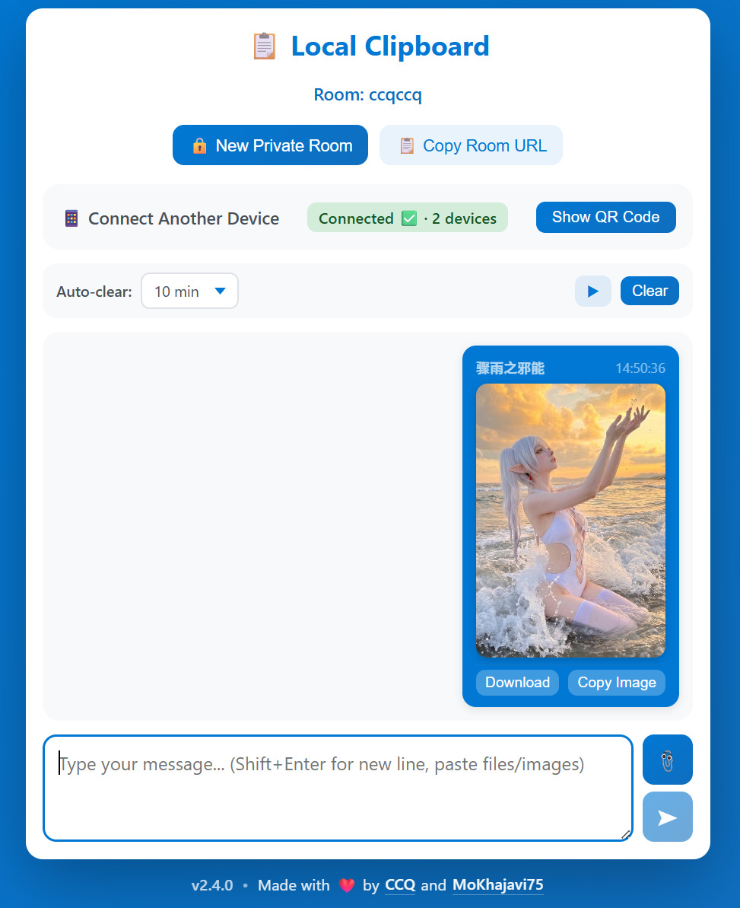

# Local Clipboard 📋

A simple, elegant local network clipboard/chat application. Share text and files between devices on your local network without internet.

<p align="center">
  
</p>

## Features

- ✨ Beautiful, modern UI with gradient design
- 🔄 Real-time text sharing via WebSocket
- 📎 File sharing and download support
- 📱 Works on any device with a browser (desktop, mobile, tablet)
- 🌐 No internet required - works on local network only
- 💾 Messages stay in memory; files are streamed to a temporary disk directory and cleared when the server stops
- 🕘 Late-joining devices catch up on the current session history
- 📋 One-click copy to clipboard
- 🎨 Responsive design for all screen sizes
- 🔒 Local network only - no data leaves your network

## Getting Started

### Download Latest Release

Download the latest prebuilt binary for your operating system from the [Releases](../../releases) page:

- **macOS**: Download `local-clipboard-vX.X.X-mac-silicon` or `local-clipboard-vX.X.X-mac-intel`
- **Linux**: Download `local-clipboard-vX.X.X-linux-amd64`
- **Windows**: Download `local-clipboard-vX.X.X-windows-amd64.exe`

All binaries are self-contained with embedded web assets - no additional dependencies required.

### Run the Application

**macOS/Linux:**

```bash
# Make it executable
chmod +x ./local-clipboard-*

# Run the server (default port 8080)
./local-clipboard-*

# Or with custom port
./local-clipboard-* -port 3000
```

**Windows:**

```bash
# Run the server
local-clipboard-*.exe

# Or with custom port
local-clipboard-*.exe -port 3000
```

The terminal will display the server URLs for both localhost and your local network IP.

## Usage

1. **On your laptop/desktop:**
   - Open `http://localhost:8080`

2. **On your phone/tablet:**
   - Open `http://<your-ip>:8080` (e.g., `http://192.168.1.100:8080`)
   - The exact URL is shown in the terminal when you start the server

3. **Start sharing:**
   - Type a message and press Enter to send (Shift+Enter for new line)
   - Click the 📎 button to attach a file
   - Messages and files appear instantly on all connected devices
   - Click "Copy" to copy text to clipboard
   - Click "Download" to save files

## HTTP API

You can also send text or files via `curl` without opening the web UI. The room is created automatically if it does not exist.

### Send text

```bash
# Default room
curl -s -X POST http://localhost:8080/api/send \
  -H "Content-Type: application/json" \
  -d '{"text":"hello from curl"}'

# Private room (created automatically if missing)
curl -s -X POST http://localhost:8080/r/my-room/api/send \
  -H "Content-Type: application/json" \
  -d '{"text":"hello in my-room"}'
```

### Upload a file

```bash
# Default room
curl -s -X POST http://localhost:8080/api/send \
  -F "file=@/path/to/file.txt"

# Private room
curl -s -X POST http://localhost:8080/r/my-room/api/send \
  -F "file=@/path/to/file.txt"
```

### List messages and file URLs

```bash
# Default room
curl -s http://localhost:8080/api/messages | jq .

# Private room
curl -s http://localhost:8080/r/my-room/api/messages | jq .
```

### Download all files from a room

```bash
curl -s http://localhost:8080/r/my-room/api/messages \
  | jq -r '.files[].url' \
  | xargs -n1 curl -LO
```

## Shell wrapper

You can download the helper script directly from the repository and source it into your shell:

```bash
source <(curl -fsSL https://raw.githubusercontent.com/chucongqing/local-clipboard/main/scripts/local-clipboard.sh)
```

Or save it first and then source it:

```bash
curl -fsSL https://raw.githubusercontent.com/chucongqing/local-clipboard/main/scripts/local-clipboard.sh -o local-clipboard.sh
source ./local-clipboard.sh
```

Once sourced, use the functions:

```bash
# Configure target server and room (empty args keep the defaults)
lc_set_env 192.168.1.100:8080 my-room http

# Send text
lc_send_text "hello from the shell"

# Upload a file
lc_send_file /path/to/file.txt

# List messages and file URLs
lc_messages

# Download every file in the current room
lc_download_all

# Clear the room
lc_clear

# Server version
lc_version
```

The wrapper uses the following environment variables (all have sensible defaults):

- `LOCAL_CLIPBOARD_HOST` – default `localhost:8080`
- `LOCAL_CLIPBOARD_ROOM` – default empty (the default room)
- `LOCAL_CLIPBOARD_SCHEME` – default `http`

## Building from Source

If you prefer to build from source:

### Prerequisites

- Go 1.24.0 or later installed
- Devices connected to the same local network

### Build and Run

```bash
# Show all available commands
make help

# Install dependencies
go mod download

# Run the server (default port 8080)
make run

# Run with custom port
make run PORT=3000

# Build for multiple platforms
make build
```

### Offline Development

If you need to work offline, you can vendor the dependencies:

```bash
go mod vendor
```

This will download all dependencies into a `vendor/` directory for offline use.

## Docker

### Run with Docker

```bash
docker run -p 8080:8080 ghcr.io/mokhajavi75/local-clipboard:latest
```

### Run with Docker Compose

```yaml
services:
  local-clipboard:
    image: ghcr.io/mokhajavi75/local-clipboard:latest
    restart: unless-stopped
    ports:
      - "8080:8080"
```

### QR Code Host in Docker

Inside a container `getLocalIP()` returns the container's internal IP (e.g. `172.17.0.x`), which is not reachable from the host or other devices on the LAN. Set `LOCAL_CLIPBOARD_HOST` to the host's reachable address so the QR code and startup logs point clients to the right place:

```bash
docker run -p 8080:8080 -e LOCAL_CLIPBOARD_HOST=192.168.1.100 ghcr.io/mokhajavi75/local-clipboard:latest
```

```yaml
services:
  local-clipboard:
    image: ghcr.io/mokhajavi75/local-clipboard:latest
    restart: unless-stopped
    ports:
      - "8080:8080"
    environment:
      - LOCAL_CLIPBOARD_HOST=192.168.1.100
```

### Behind a Reverse Proxy

When running behind a reverse proxy, configure it to forward the real client IP so sender labels show correctly instead of the Docker gateway IP.

**Caddy:**

```caddy
example.com {
  reverse_proxy 127.0.0.1:8080 {
    header_up X-Real-IP {remote_host}
  }
}
```

> Caddy sets `X-Forwarded-For` automatically; the `header_up` line adds `X-Real-IP` as well.

**nginx:**

```nginx
location / {
  proxy_pass http://127.0.0.1:8080;
  proxy_set_header X-Forwarded-For $remote_addr;
  proxy_set_header X-Real-IP       $remote_addr;
}
```

Enjoy your local clipboard! 🎉
